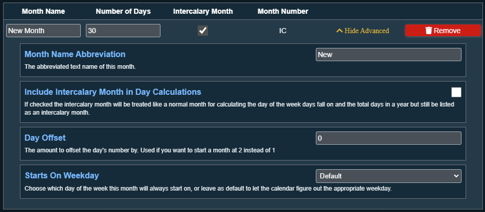

# Month Settings

This section displays a list of the months for the selected calendar.

:::caution Important
A calendar must always have at least **1 month**. If all months are removed, one will automatically be added back in with default values set.
:::

## Months

With the options below you can configure each month for this calendar.

### Month Name

The full name of the month. This will show if configured in any of the [Date/Time Formatting](display-options#datetime-formatting) settings.

### Number of Days

The number of days each month contains. 

:::tip
After configuring all months be sure to check out the [Leap Year settings](leap-year-settings) to make sure each month has the correct number of days during a leap year!
:::

:::tip
A month can have 0 days. If this is set then the month will not appear during normal years, but can appear during leap years!
:::

### Intercalary Month

An intercalary month is one that does not follow the standard month numbering and is skipped.

Example: If we were to add an intercalary month between January and February, January would still be considered the first month and February would be considered the second month. The new month does not get a number.

Intercalary months also do not count towards the years total days nor do they affect the day of the week subsequent months start on.

### Month Name Abbreviation

Set the abbreviated name for the month. This defaults to the first 3 letters of the months name. This will show if configured in any of the [Date/Time Formatting](display-options#datetime-formatting) settings.

### Include Intercalary Month in Day Calculations

When you select a month to be intercalary this option will appear. When checked the intercalary month will be treated like a normal month for calculating the day of the week days fall on and the total days in a year but still be listed as an intercalary month.

### Day Offset

The number of days to offset the day's numbering by for this month. Example: Setting to 1 will have the month start on day 2 instead of day 1.

### Starts On Weekday

Choose which day of the week that this month starts on. Leave on Default to have the calendar figure out the appropriate weekday to start the month on.

## Adding A New Month

Under the list of months there is a button called "Add New Month". Clicking this button will add a new month to the bottom of the list with the default settings.

## Remove Month(s)

Next to each month is a remove button that will remove that specific month from the calendar. Under the list of months there is a button called "Remove All Months" that will remove every month from the list.

If the last month is removed, a new default month is added. This is because a Calendar can not have 0 months.
