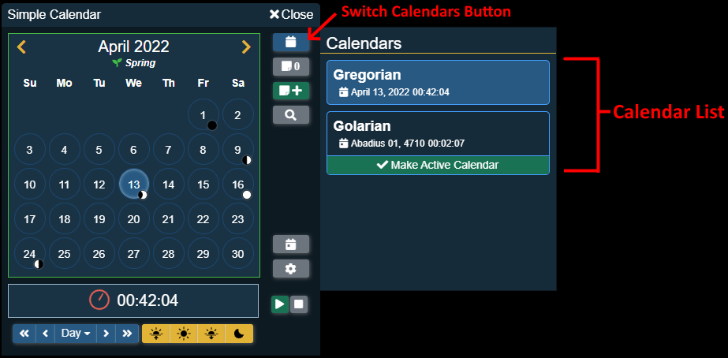

# Switching Calendars

If there is more than one calendar configured in Simple Calendar a button will appear on the main application to allow switching between them.

Clicking the button will show a list of all configured calendars.

 

There are two states for calendars, active and being viewed. The list allows a user to view different calendars and if [given permission](../global-configuration/permissions.md) change the currently active calendar.
Each state is described in more detail below.

## Viewing Other Calendars

To view another calendar a user just needs to click on the box with that calendars name and current date. This will change the [calendar view](calendar-view.md) to show the current date and time for that calendar. 

Users are allows to switch through the months, view and search any notes they are allowed to see and add new notes (given then have [permission to add notes](../global-configuration/permissions.md)).

If a user has [permission to change the date and time](../global-configuration/permissions.md) they will notice that the change date and time controls are missing. The date and time can only be changed on the currently active calendar.

## Changing the Active Calendar

If a user is the GM or has [permission to change the active calendar](../global-configuration/permissions.md) then they will see a button beneath each calendars' data. This button, named `Make Active Calendar`, will change the currently active calendar to the one the button is associated with.

Changing a calendar to be active will do the following things:

- Change the [calendar view](calendar-view.md) for every connected player to the new active calendar.
- Allow users that have [permission to change the date and time](../global-configuration/permissions.md) to change the date and time of this calendar.
- Updates the world time to the new calendars time stamp. This will update any other time modules that use Simple Calendar to display the new date and time.

:::danger
This will also cause any **affects/conditions** that expire after a certain amount of time **to either expire or last longer** than intended.
:::
 
