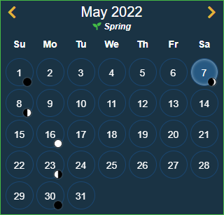
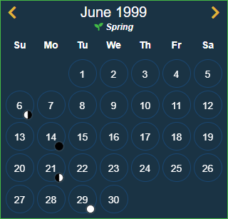
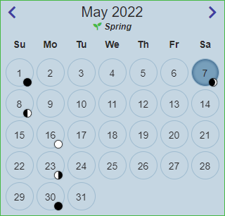

The Simple Calendar module comes with some built in Handlebar helpers that can be used by other modules/systems to display information in areas other than in the Simple Calendar module.

## Enumeration Members

### sc-clock

• **sc-clock** = `number`

This handlebar helper is used to generate the HTML for displaying a clock view for the current time of the specified calendar.

**`Remarks`**

The clock does not automatically update. Listening to the [DateTimeChange](../namespaces/SimpleCalendar.Hooks.md#datetimechange) hook would allow you to refresh the clock display.

**Parameters**

- **id:** *string* = ""<br/>The unique ID to set in the clock HTML.<br/><br/>
- **calendarId:** *string* = ""<br/>The ID of the calendar to get the time from. If no ID is provided the current active calendar will be used.<br/><br/>
- **theme:** *string* = "auto"<br/>The theme you want the clock to have. 'auto' means the theme will match what ever theme the current user has selected, 'none' means no theme will be applied, 'dark', 'light', 'classic' will apply that specific theme to the clock.

You can customize the clocks theme, how it looks, to be anything you like if you follow these steps:
- Set the theme parameter to 'none'.
- wrap them handlebar helper in a div with the 'simple-calendar' class (if you wish to keep the same structure for the calendar) `<div class="simple-calendar"></div>`
- Create your custom CSS

**Examples**:

**`Example`**

Default Display
```html
{{sc-clock id='unique_id' }}
```


**`Example`**

Specified Theme

This forces the theme to be the light theme for the clock, regardless of what the current users preferred Simple Calendar theme is set too.
```html
{{sc-clock id='unique_id' theme='light'}}
```


**`Example`**

Specific Calendar
```html
{{sc-clock id='unique_id' calendarId='b74474f7' }}
```

___

### sc-full-calendar

• **sc-full-calendar** = `number`

This handlebar helper is used to generate the HTML for displaying a full calendar view for the current date or a passed in date.

**`Remarks`**

Don't forget to call the [activateFullCalendarListeners](../namespaces/SimpleCalendar.api.md#activatefullcalendarlisteners) function for any calendars that should be interactive. Static displays do not need to call this function.
A unique ID is required to ensure proper functionality of a Calendar added with this Handlebar helper.
<br/><br/>

**Parameters**

- **allowChangeMonth:** *boolean* = true<br/>If to allow months to be changed on this display.<br/><br/>
- **colorToMatchSeason:** *boolean* = true<br/>If to color the background of the calendar to match the color of the season the date falls on.<br/><br/>
- **cssClasses:** *string* = ""<br/>Any custom CSS classes to add to the wrapper div around the calendar.<br/><br/>
- **date:** *boolean* = true<br/>The year and the month index to display for the full calendar view.<br/><br/>
- **id:** *string* = ""<br/>The unique ID to set in the calendar HTML.<br/><br/>
- **showCurrentDate:** *boolean* = true<br/>If to highlight the current date on the calendar.<br/><br/>
- **showDescriptions:** *boolean* = true<br/>If to show the description pop ups for months,weekdays,seasons that have a description.<br/><br/>
- **showSeasonName:** *boolean* = true<br/>If to show the season name in the calendar view.<br/><br/>
- **showNoteCount:** *boolean* = true<br/>If to show the indicator for notes on the days being displayed.<br/><br/>
- **showMoonPhases:** *boolean* = true<br/>If to show the moon phases for the days being displayed.<br/><br/>
- **showYear:** *boolean* = true<br/>If to show the year in the header text of the full calendar.<br/><br/>
- **theme:** *string* = "auto"<br/>The theme you want the calendar to have. 'auto' means the theme will match what ever theme the current user has selected, 'none' means no theme will be applied, 'dark', 'light', 'classic' will apply that specific theme to the calendar.

You can customize the calendars theme, how it looks, to be anything you like if you follow these steps:
- Set the theme parameter to 'none'.
- wrap them handlebar helper in a div with the 'simple-calendar' class (if you wish to keep the same structure for the calendar) `<div class="simple-calendar"></div>`
- Create your custom CSS

**Examples**:

Assuming the Gregorian calendar with a current date of December 15th, 2021 for all examples.

**`Example`**

Default
```html
{{sc-full-calendar id='custom_id'}}
```


**`Example`**

All Options Disabled
```html
{{sc-full-calendar id='custom_id' colorToMatchSeason=false showCurrentDate=false showSeasonName=false showNoteCount=false showMoonPhases= false showYear=false}}
```


**`Example`**

Specific Date Set

Assumes that there is a variable called newDate that looks like this:
```javascript
let newDate = {
    year: 1999,
    month: 5
};
```
```html
{{sc-full-calendar id='custom_id' date=newDate }}
```


**`Example`**

Specified Theme

This forces the theme to be the light theme for this calendar, regardless of what the current users preferred Simple Calendar theme is set too.
```html
{{sc-full-calendar id='custom_id' theme='light' }}
```


___

### sc-icon

• **sc-icon** = `number`

This handlebar helper is used to render one of the icons included with Simple Calendar.

**Parameters**

- **name:** *[Icons](SimpleCalendar.api.Icons.md)*<br/>Which icon to display.<br/><br/>
- **stroke:** *string* = "#000000"<br/>The HEX color to set the stroke of the icons SVG.<br/><br/>
- **fill:** *string* = "#000000"<br/>The HEX color to set the fill of the icons SVG.<br/><br/>

**`Example`**

Display an Icon
```html
{{sc-icon name='clock' }}
```


**`Example`**

Display a custom colored Icon
```html
{{sc-icon name='clock' fill='#ff0000' stroke='#ff0000' }}
```

