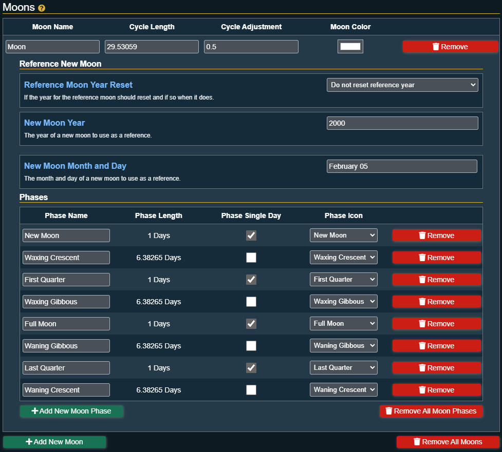

# Moon Settings

This section allows the configuration of the different moons in the world so that their cycles display on the calendar.

There are lots of settings when configuring a moon to make it as customized as you would like.

## Moon Name

The name of the moon, used to help distinguish between moons when there are more than one. Will show when hovering over a moon on the [calendar view](../using-sc/calendar-view).

## Cycle Length

How many days it takes the moon to go from new moon to new moon. This field supports decimal places to get as precise as needed.

## Cycle Adjustment

When calculating how many days into a cycle a given date is, adjust that by this many days. This value will most likely be a decimal of less than 1 as adjustments do not need to be that large but supports any number.

:::tip
A value of **0.5** works best for most moons to shift the phases into the correct dates.
:::

## Moon Color

A color to associate with the moon. This is used to color the moon icons on the calendar view and helps distinguish between multiple moons.

## Adding a New Moon

Under the list of moons there is a button called "Add New Moon". Clicking this button will add a new moon to the list.

## Removing Moon(s)

Next to each moon is a remove button that will remove that specific moon from the list. Under the list of moons there is a button called "Remove All Moons" that will remove every moon from the list.

## Reference New Moon Settings

This group of settings is used to tell the Calendar when a past New Moon occurred so that it can base when other new moons will occur.

### Reference Moon Year Reset

This can be used to tell the calendar to reset the year portion of the reference new moon. Options are:
- **Do not reset reference year**: this will always use the entered year as the reference year.
- **Reset reference year every leap year**: This will reset the reference year being used to the year of the most recent leap year. Some calendars (Harptos) have their moons cycle reset on leap years.
- **Reset reference year every X years**: The same as the reset every leap year but instead will reset every X number of years entered. This is handy if the reference years need to reset and there are no leap years, or they reset on a different schedule than leap years.

### New Moon Year

:::caution Important
This only shows when the [Reference Moon Year Reset](#reference-moon-year-reset) is set to **Do not reset reference year**.
:::

This is the year of the reference new moon.

### Reset Reference Moon Years

:::caution Important
This only shows when the [Reference Moon Year Reset](#reference-moon-year-reset) is set to **Reset reference year every X years**.
:::

This is how often, in years, to reset the reference year.

### New Moon Month and Day

The month and day for when the reference new moon took place on. This uses a date selector to make choosing this date easy!

## Phases

This section allows for the customization of the different phases of the moon. Generally there will be no need to change the defaults for this, but the option is there in case it is required.

### Phase Name

The name of the phase.

### Phase Length

The calculated number of days this phase will last based on the total number of phases and the moons cycle length.

### Phase Single Day

If this phase should only happen on 1 day, rather than over several days. This is used from the important moon phases like full moon.

### Phase Icon

Select from a list of available icons to use when displaying this phase of the moon.

### Adding a New Moon Phase

Under the list of moon phases there is a button called "Add New Moon Phase". Clicking this button will add a new moon phase to the list.

### Removing Moon Phase(s)

Next to each moon phase is a remove button that will remove that specific moon phase from the list. Under the list of moons there is a button called "Remove All Moons Phases" that will remove every moon phase from the list.
